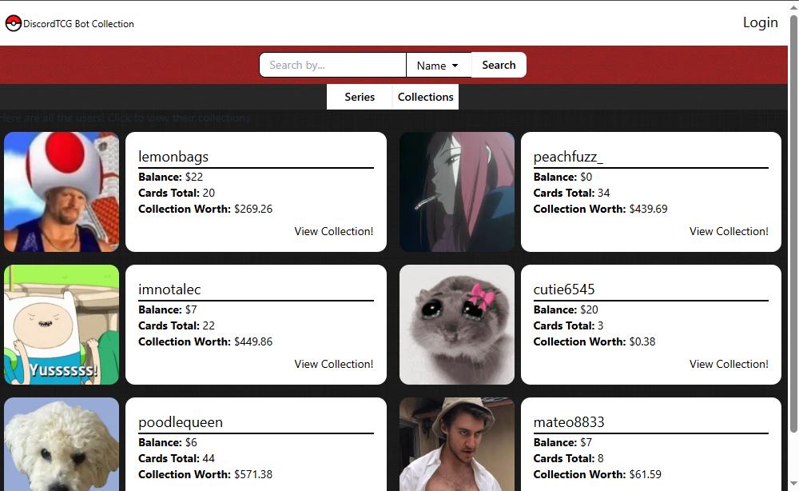
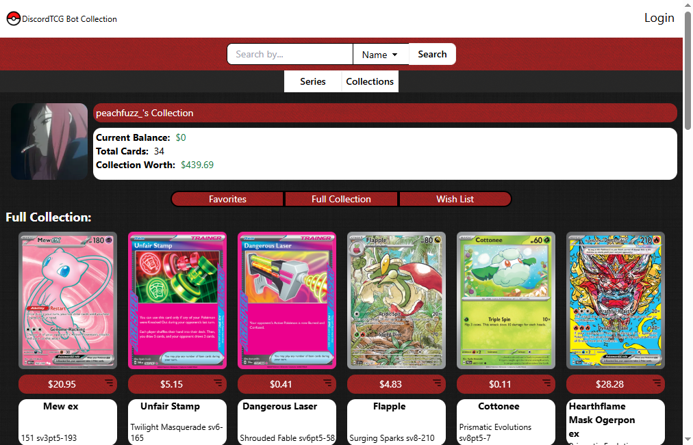
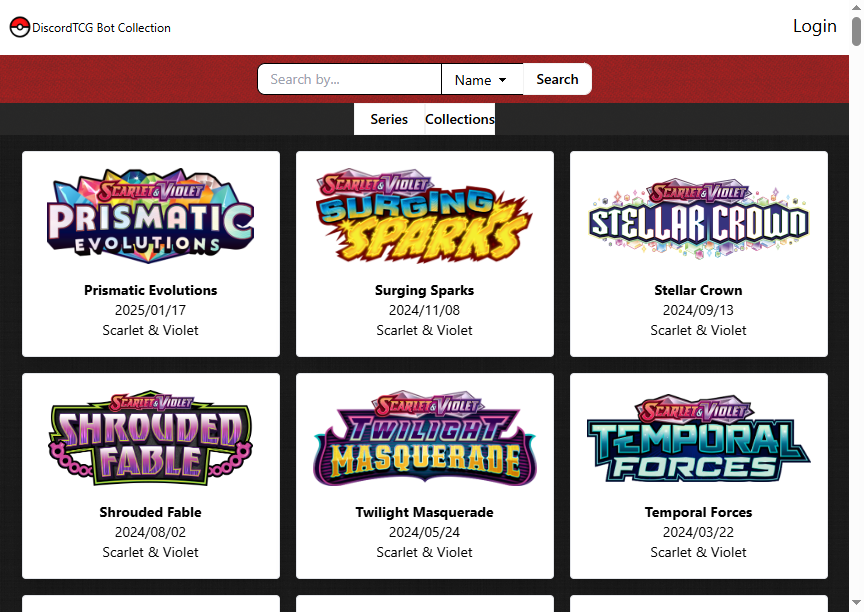
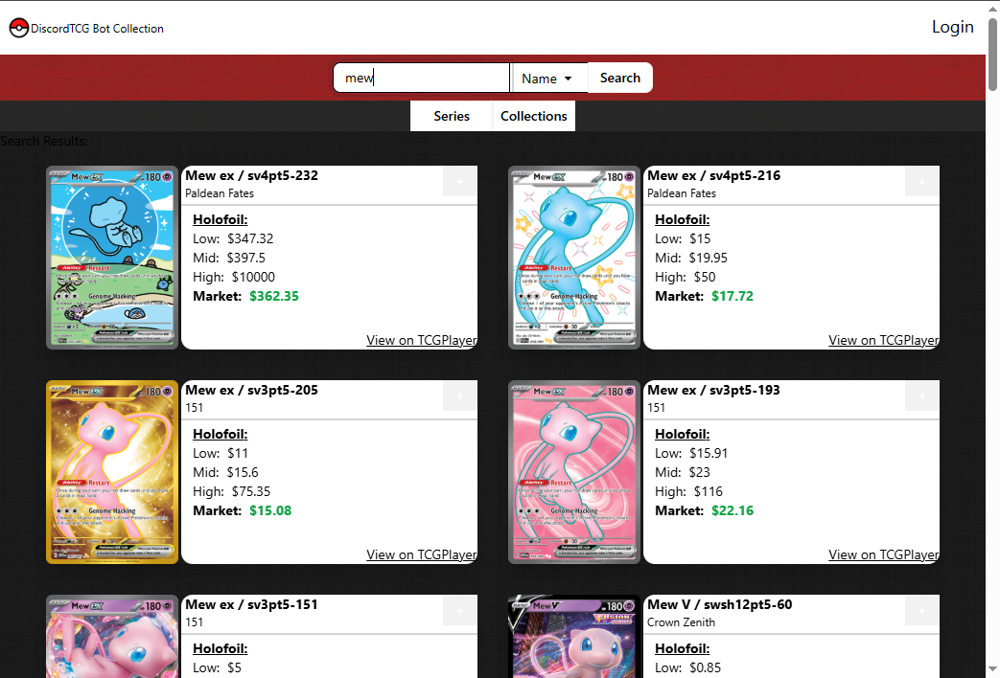

# TCG Collection Site (WIP)

## Deployed Site

[Discord-TCG-Bot-Site](https://discord-tcg-bot-app-83248ef6c529.herokuapp.com/)

## Discord Bot

This is the web app for the TCG Discord bot also created by me (nshaw973).

[Discord-Bot](https://github.com/nshaw973/MyDiscord-Bot)

## Technologies

- Javascript
- MongoDB
- Mongoose
- Express
- React
- NodeJS
- TailwindCSS
- DaisyUI
- GraphQL
- Bcrypt

## About

This website is the backend component of the Discord Bot Application, designed to store and manage data from user-opened booster packs. Users can view their collections, add cards to a favorites list, and explore detailed information about the contents of each booster pack.

Currently the site is a work in progress. Right now it is able to allow users to search for sets or specific pokemon.

When it comes to the Discord Bot, everything is done through the bot. Users can log in and view or share their collection to others, "sell", and favorite cards.

## Screenshots

## Credit

Github: [nshaw973](https://github.com/nshaw973)

